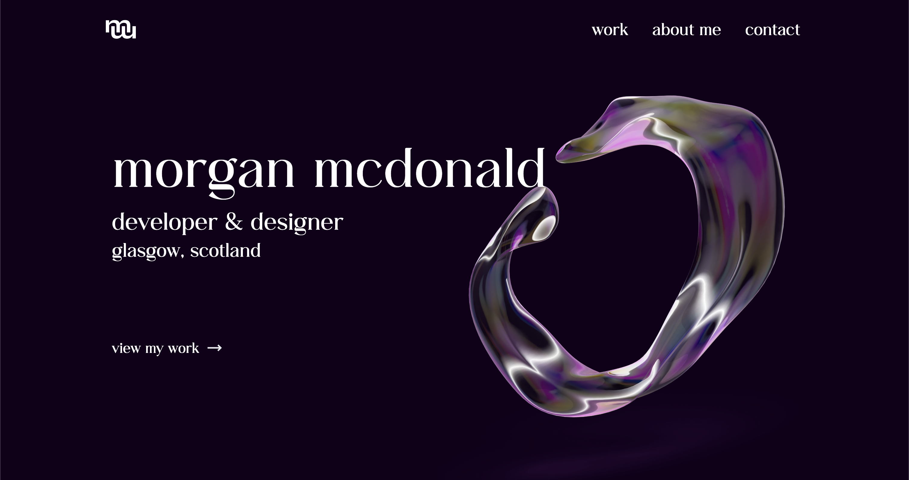

# Morgan McDonald - Personal Site



## Project Structure

Inside of this Astro project, you'll see the following directory structure:

```text
/
├── public/
│   └── fonts/
│   └── projectImages
│       └── All relevant project images and sub-folders
│   └── favicon.svg
│   └── preview.png
├── src/
│   └── components/
│       └── All relevant components
|   └── content/
│       └── projects/
│           └── projects/
│               └── All project markdown files
│       └── config.ts
│   └── images/
│       └── All relevant images for the main site
│   └── layouts/
│       └── Layout.astro
│   └── pages/
│       └── index.astro
│       └── [slug].astro
│   └── styles/
│       └── All relevant .css and .scss style files
└── constants.ts
└── package.json
└── README.md
```

## About this project

I created this site both as a personal portfolio site, as well as an introduction to Astro. I used the building of this site to teach me the file structure and practices of building sites using Astro to build upon my skills.

### Project Contents

- Main home page
- Front page with featured projects listed
- About me sections
- Contact form
- Individual pages for each project for more detail
- An archive page for all projects (To be added)
- An archive page for blog posts (To be added)
- Custom 404 page
